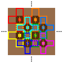
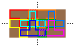
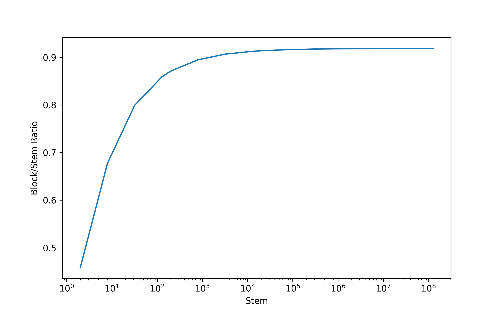

# MelonSim
模拟Minecraft中的西瓜/南瓜田在特定排列模式下的果实/茎比率期望

见知乎问题：[MC 中以如下一些固定模式无限延伸的南瓜田最终能结出的南瓜与南瓜茎个数之比的期望是多少？](https://www.zhihu.com/question/2073824638543647920)

我的知乎回答：https://www.zhihu.com/question/2073824638543647920/answer/2091565319542281687

注：C#代码和CSV中的Ratio是生长点位空置率，Python代码和图表中Ratio的是果实/茎比率。

CSV列说明：
- Size：茎数量
- Factor：倍率，聚合了多少个相同茎数量的模拟结果
- Empty：空置的生长点位数量
- Block：果实数量
- Ratio：生长点位空置率

## 目前实现的模式

图例：
- 淡棕色方块：泥土，西瓜/南瓜可以生长在上面
- 深棕色方块：耕地，可以放置西瓜茎/南瓜茎
- 彩色方块：上面的黄色西瓜茎/南瓜茎会随机挑选周围的一个有效位置生长一个西瓜/南瓜
- 彩色方框：每个茎对应的可生长范围

### 模式A

实际模式：在单个轴上，耕地和泥土交错排列，每个耕地上的茎有2个可选位置，每个可用点位贴着2个耕地

节约内存表示：略去耕地所占位置

约0.8766

### 模式B

实际模式：在X轴和Z轴上耕地和泥土均交错排列，每个耕地上的茎有4个可选位置，每个可用点位贴着2个耕地

节约内存表示：略去耕地所占位置，可选位置范围变为交叠的T字形

约0.9987

### 模式C

实际模式：在X轴和Z轴上耕地和泥土均交错排列，每个耕地上的茎有4个可选位置，每个可用点位贴着4个耕地

节约内存表示：略去耕地所占位置，可选位置范围变为交叠的正T字形和反T字形

约0.9187

