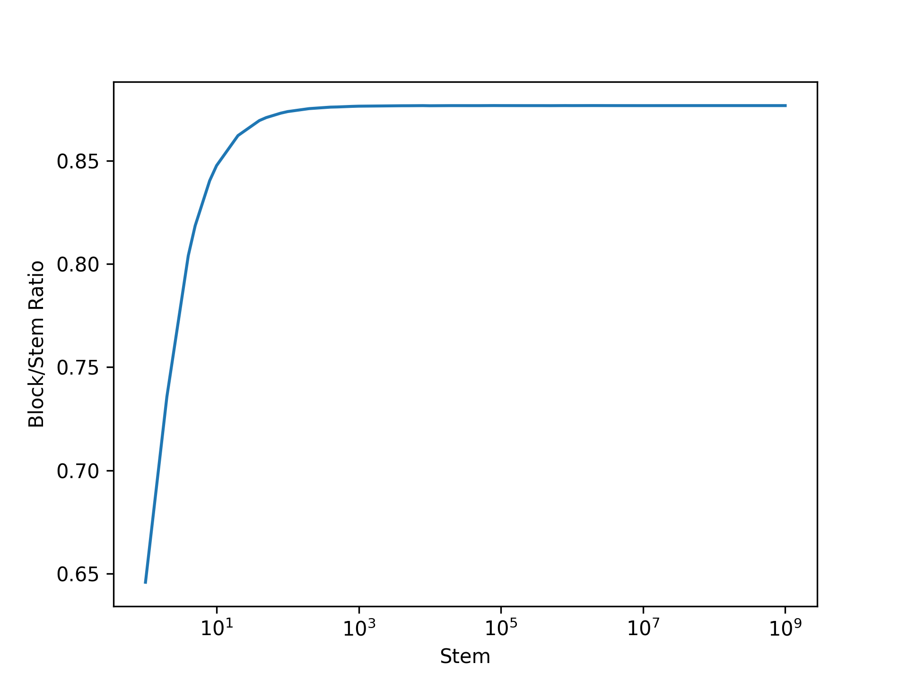
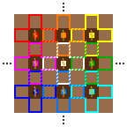
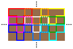
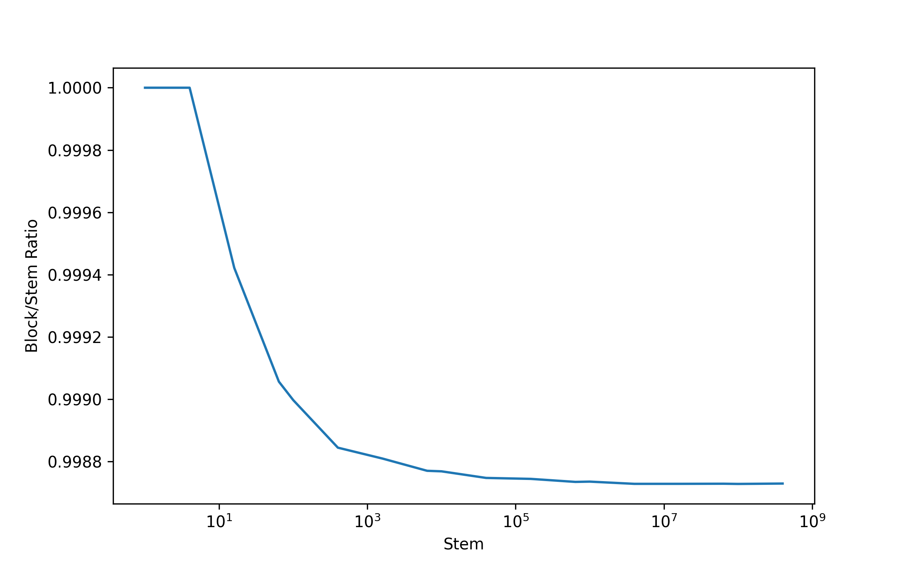

# MelonSim
模拟Minecraft中的西瓜/南瓜田在特定排列模式下的期望面积利用率

见知乎问题：[MC 中以如下一些固定模式无限延伸的南瓜田最终能结出的南瓜与南瓜茎个数之比的期望是多少？](https://www.zhihu.com/question/2073824638543647920)

## 目前实现的模式

### 模式A

实际模式：在单个轴上，耕地和泥土交错排列，每个耕地上的茎有2个可选位置，每个可用点位贴着2个耕地

节约内存表示：略去耕地所占位置

0.87660~0.87661

### 模式B

实际模式：在X轴和Z轴上耕地和泥土均交错排列，每个耕地上的茎有4个可选位置，每个可用点位贴着2个耕地

节约内存表示：略去耕地所占位置

0.99872~0.99873

